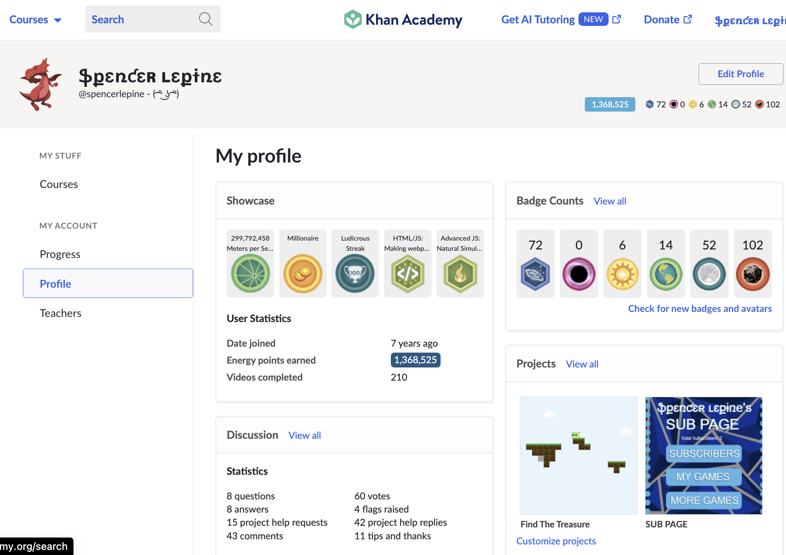

# Khan Academy Javascript Projects (archive)

Archive for my Khan Academy projects, written in Javascript (using p5.js) and HTML code. These projects were made from 2016-2019 with the Khan Academy Computer Programming courses. I learned basic Javasript, SQL, HTML and CSS with these courses. I had lot's of fun building platformer games and animations.

I included a working p5.js library file to run the games, but I add screenshot/gifs as well since it is pretty flaky.

## Repositories

- [x] findTheTreasure
- [x] findTheTreasureTwo
- [x] twoByRubiksCube
- [x] threeByRubiksCube
- [x] pepesAdventure
- [x] AstroJumperGame
- [ ] recursiveAnimation
- [ ] factorialTree
- [ ] factorialSquares
- [ ] vroomVroomGame
- [ ] logoDesign
- [ ] AstroJumperGameLogo
- [ ] spaceAnimation
- [ ] typer
- [ ] pvectorPractice
- [ ] matrixRain

