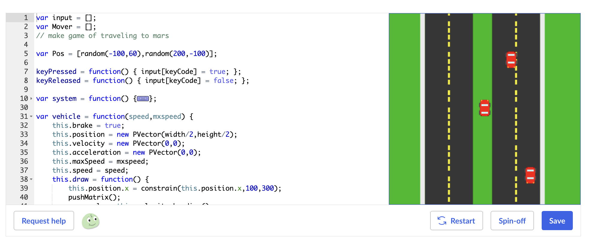
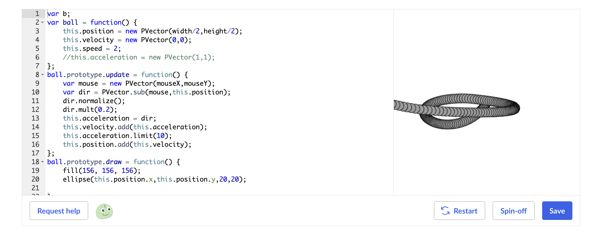

# Khan Academy Javascript Projects (archive)

Archive for my Khan Academy projects, written in Javascript (using p5.js) and HTML code. These projects were made from 2016-2019 with the Khan Academy Computer Programming courses. I learned basic Javasript, SQL, HTML and CSS with these courses. I had lot's of fun building platformer games and animations.

I included a working p5.js library file to run the games, but I add screenshot/gifs as well since it is pretty hard to run locally

## Profile Screenshot

## Projects

### Find The Treasure (Game) [[Repository](https://github.com/spencerlepine/find-the-treasure-javascript-game)]

### Find the Treasure 2 (Game) [[Repository](https://github.com/spencerlepine/find-the-treasure-two-javascript-game)]

### Pepe's Adventure (Game) [[Repository](https://github.com/spencerlepine/pepes-adventure-javascript-game)]

### Astro Jumper (Game) [[Repository](https://github.com/spencerlepine/astro-jumper-javascript-game)]

### 3x3 Rubiks Cube [[Repository](https://github.com/spencerlepine/javascript-rubiks-cube)]

### 2x2 Rubiks Cube [[Repository](https://github.com/spencerlepine/javascript-rubiks-cube-two-by-two)]

### recursiveAnimation [[Link](https://www.khanacademy.org/computer-programming/cool-recursive-line-drawing/5736291223928832)]

### factorialTree [[Link](https://www.khanacademy.org/computer-programming/fractal-tree/5509463901831168)]

### factorialSquares [[Link](https://www.khanacademy.org/computer-programming/factorial-squares/6330478439530496)]

### vroomVroomGame [[Link](https://www.khanacademy.org/computer-programming/vroom-vroom-wip/4983897019580416)]

### logoDesign [[Link](https://www.khanacademy.org/computer-programming/logo/5247892378025984)]

### AstroJumperGameLogo [[Link](https://www.khanacademy.org/computer-programming/astrojumper-logo/5653563149844480)]

### spaceAnimation [[Link](https://www.khanacademy.org/computer-programming/spin-off-of-project-creature-colonies/4709439248334848)]

### typer [[Link](https://www.khanacademy.org/computer-programming/typer/6751589343494144)]

### pvectorPractice [[Link](https://www.khanacademy.org/computer-programming/pvector-practice/5556020818280448)]

### matrixRain [[Link](https://www.khanacademy.org/computer-programming/matrix-rain-animation/4517691865759744)]

